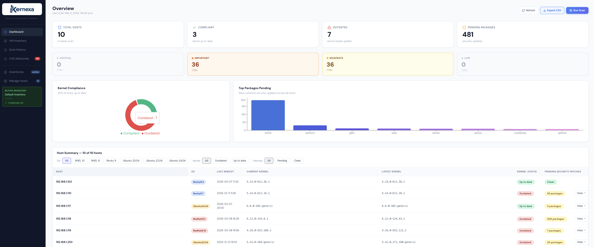
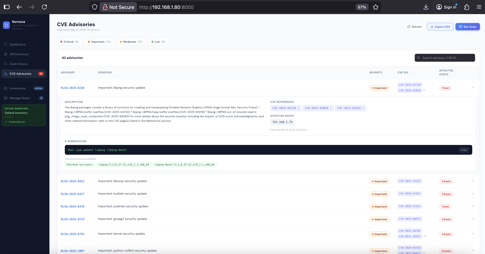

# Kernexa

A patch compliance platform for Linux infrastructure. Kernexa uses Ansible to scan remote hosts for pending security patches, outdated kernels, and CVE advisories — all surfaced in a clean web dashboard.





## Stack

| Layer | Technology |
|-------|-----------|
| Backend | Python 3 / FastAPI |
| Scanner | Ansible + ansible-runner |
| Database | PostgreSQL 16 |
| Frontend | React + Vite |
| Deployment | Docker Compose |

## Current Supported OS and CVE advisories

| Distribution | Versions | CVE Source |
|---|---|---|
| RHEL | 8, 9, 10 | Red Hat Security API (RHSA) |
| Rocky Linux | 8, 9 | Rocky Errata API (RLSA) |
| Ubuntu | 20.04, 22.04, 24.04 | Ubuntu CVE Tracker |

> Other distributions are scanned for kernel/package status but CVE enrichment will not be available.

---

## Quick Start

**1. Clone and configure**
```bash
git clone <your-repo-url>
cd kernexa
cp .env.example .env        # edit with your preferred credentials
```

**2. Start services**
```bash
docker compose up --build -d
```

**3. Initialize the database** *(run once)*
```bash
docker compose exec app python init_db.py
```

**4. Build the frontend**
```bash
cd patch-scan-ui
npm install
npm run build
```

Open [http://localhost:8000](http://localhost:8000) — Adminer at [http://localhost:8080](http://localhost:8080).

---

## Configuration

### .env

Copy `.env.example` to `.env` and set your own values. This file is never committed.

```env
POSTGRES_DB=kernexa
POSTGRES_USER=kernexa_user
POSTGRES_PASSWORD=changeme
POSTGRES_PORT=5432
```

The app reads these automatically via Docker Compose — no need to edit `database.py` or `docker-compose.yml`.

### SSH Credentials

SSH credentials are entered through the UI per inventory and stored in the database. They are retrieved at scan time and passed directly to ansible-runner — no credentials file is written to disk.

---

## Project Structure

```
.
├── main.py              # FastAPI — all API routes
├── scanner.py           # ansible-runner integration
├── database.py          # DB queries (psycopg2)
├── enricher.py          # CVE enrichment (RHSA / RLSA / Ubuntu)
├── init_db.py           # Schema init — run once
├── patch_scan.yml       # Ansible playbook
├── docker-compose.yml
├── Dockerfile
├── .env                 # Your local config (not committed)
├── .env.example         # Template — copy to .env
├── inventory/hosts      # Active inventory (written at runtime)
└── patch-scan-ui/       # React + Vite frontend source
```

---

## How It Works

1. Upload an Ansible inventory and set SSH credentials in the UI
2. Trigger a scan manually or let the auto-scheduler run every 3 hours
3. Ansible collects kernel versions and pending security packages from each host
4. Results are saved to PostgreSQL and CVE data is enriched from upstream security APIs
5. The dashboard shows compliance status, outdated kernels, and CVE advisories per host

---

## Database Schema

| Table | Description |
|-------|-------------|
| `scan_runs` | Scan metadata — ID, status, timestamp, return code |
| `scan_results` | Per-host kernel versions and package→source map |
| `scan_packages` | Pending security packages per host per scan |
| `cve_details` | Enriched CVE/advisory data cached from upstream APIs |
| `inventories` | Uploaded inventory files |
| `credentials` | SSH credentials per inventory (plaintext) |

---

## API Docs

Full interactive API docs are available at [http://localhost:8000/docs](http://localhost:8000/docs) once the app is running (powered by FastAPI's built-in Swagger UI).

---

## Development

**Backend without Docker**
```bash
pip install -r requirements.txt
cp .env.example .env
uvicorn main:app --reload
```

**Frontend dev server**
```bash
cd patch-scan-ui
npm install
npm run dev    # Vite on :5173 — proxies API calls to :8000
```