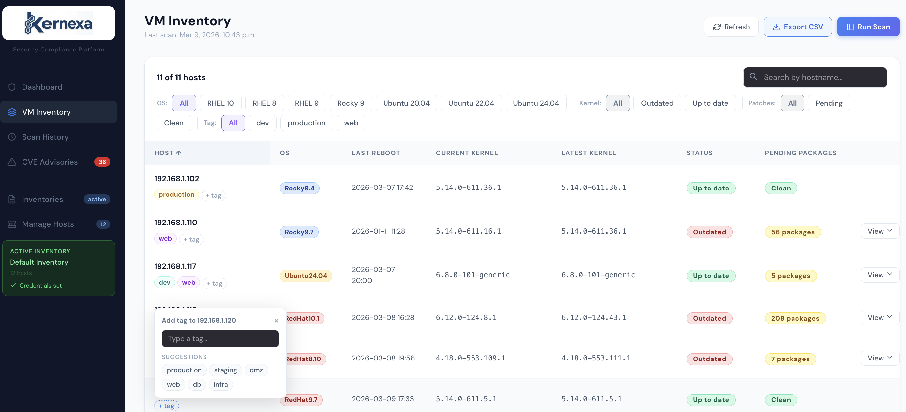
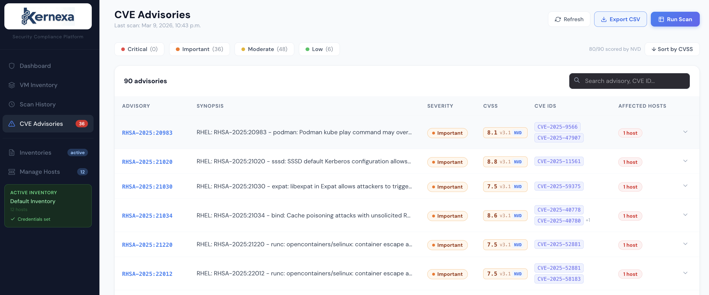

# Kernexa

A patch compliance platform for Linux infrastructure. Kernexa uses Ansible to scan remote hosts for pending security patches, outdated kernels, and CVE advisories — all surfaced in a clean web dashboard.






## Stack

| Layer | Technology |
|-------|-----------|
| Backend | Python 3 / FastAPI |
| Scanner | Ansible + ansible-runner |
| Database | PostgreSQL 16 |
| Frontend | React + Vite |
| Deployment | Docker Compose |

## Current Supported OS and CVE advisories

| Distribution | Versions | CVE Source |
|---|---|---|
| RHEL | 8, 9, 10 | Red Hat Security API (RHSA) |
| Rocky Linux | 8, 9 | Rocky Errata API (RLSA) |
| Ubuntu | 20.04, 22.04, 24.04 | Ubuntu CVE Tracker |

> Other distributions are scanned for kernel/package status but CVE enrichment will not be available.

---

## Quick Start

**1. Clone and configure**
```bash
git clone <your-repo-url>
cd kernexa
cp .env.example .env        # edit with your preferred credentials
```

**2. Start services**
```bash
docker compose up --build -d
```

Open [http://localhost:8000](http://localhost:8000) — Adminer at [http://localhost:8080](http://localhost:8080).

---

## Configuration

### .env

Copy `.env.example` to `.env` and set your own values. This file is never committed.

```env
POSTGRES_DB=kernexa
POSTGRES_USER=kernexa_user
POSTGRES_PASSWORD=changeme
POSTGRES_PORT=5432
NVD_API_KEY=your-nvd-api-key-here
```

The app reads these automatically via Docker Compose — no need to edit `database.py` or `docker-compose.yml`.

An NVD API key is optional but recommended — it raises the NVD rate limit significantly when scoring CVEs. Get one free at [nvd.nist.gov/developers/request-an-api-key](https://nvd.nist.gov/developers/request-an-api-key).

### SSH Credentials

SSH credentials are entered through the UI per inventory and stored in the database. They are retrieved at scan time and passed directly to ansible-runner — no credentials file is written to disk.

---

## Project Structure

```
.
├── main.py              # FastAPI — all API routes
├── scanner.py           # ansible-runner integration
├── database.py          # DB queries (psycopg2)
├── enricher.py          # CVE enrichment (RHSA / RLSA / Ubuntu) + CVSS scoring
├── init_db.py           # Schema init — safe to re-run on upgrades
├── patch_scan.yml       # Ansible playbook
├── docker-compose.yml
├── Dockerfile
├── .env                 # Your local config (not committed)
├── .env.example         # Template — copy to .env
├── inventory/hosts      # Active inventory (written at runtime)
└── patch-scan-ui/       # React + Vite frontend source
```

---

## How It Works

1. Upload an Ansible inventory and set SSH credentials in the UI
2. Trigger a scan manually or let the auto-scheduler run every 3 hours
3. Ansible collects kernel versions and pending security packages from each host
4. Results are saved to PostgreSQL and CVE data is enriched from upstream security APIs
5. CVSS scores are fetched automatically — Red Hat Security Data API as primary source, NVD as fallback
6. The dashboard shows compliance status, outdated kernels, CVE advisories, and CVSS scores per host

---

## Features

**Scanning**
- Kernel compliance — current vs latest available kernel per host
- Pending security packages per host
- Auto-scheduler runs every 3 hours; manual trigger available from the UI
- Scan failure capture — per-host Ansible errors surfaced in the UI

**CVE Advisories**
- Enriched from Red Hat (RHSA), Rocky Linux (RLSA), and Ubuntu CVE Tracker
- CVSS scores fetched automatically after every scan — Red Hat scores preferred, NVD fallback for unscored CVEs
- Score badge shows source (`RH` or `NVD`) so you know whether the score reflects RHEL-specific context
- Sortable by CVSS score; filterable by severity

**Host Management**
- Tag hosts with labels like `production`, `staging`, `dmz`, `web`, `db`, `infra` or any custom tag
- Filter the dashboard and VM Inventory by tag
- Tags persist across scans and are managed inline from the host table

---

## Database Schema

| Table | Description |
|-------|-------------|
| `scan_runs` | Scan metadata — ID, status, timestamp, return code, per-host failures |
| `scan_results` | Per-host kernel versions and package→source map |
| `scan_packages` | Pending security packages per host per scan |
| `cve_details` | Enriched CVE/advisory data with CVSS scores cached from upstream APIs |
| `inventories` | Uploaded inventory files |
| `credentials` | SSH credentials per inventory (plaintext) |
| `hosts` | Known hostnames |
| `host_tags` | Tags assigned to hosts — persists across scans |

---

## API Docs

Full interactive API docs are available at [http://localhost:8000/docs](http://localhost:8000/docs) once the app is running (powered by FastAPI's built-in Swagger UI).

---

## Development

**Backend without Docker**
```bash
pip install -r requirements.txt
cp .env.example .env
uvicorn main:app --reload
```

**Frontend dev server**
```bash
cd patch-scan-ui
npm install
npm run dev    # Vite on :5173 — proxies API calls to :8000
```