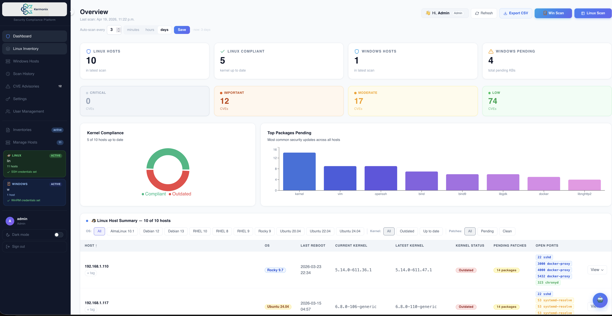
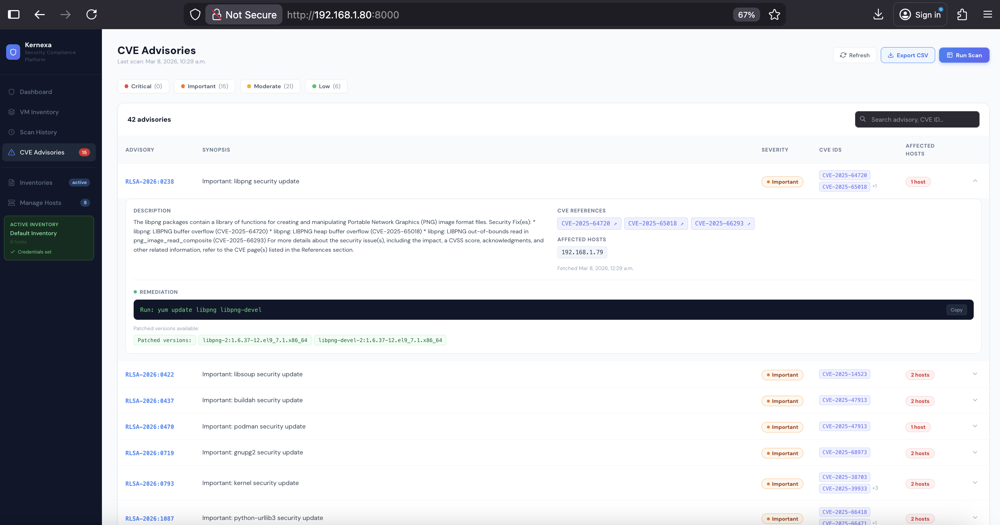
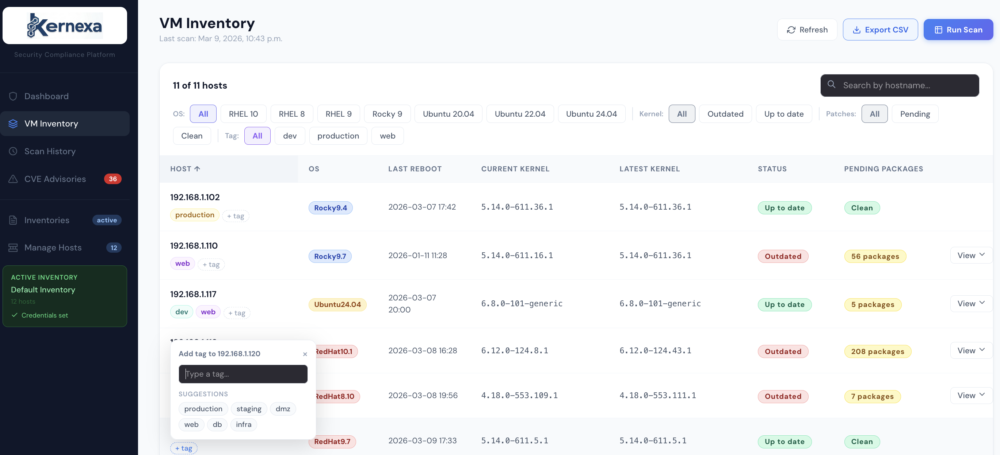
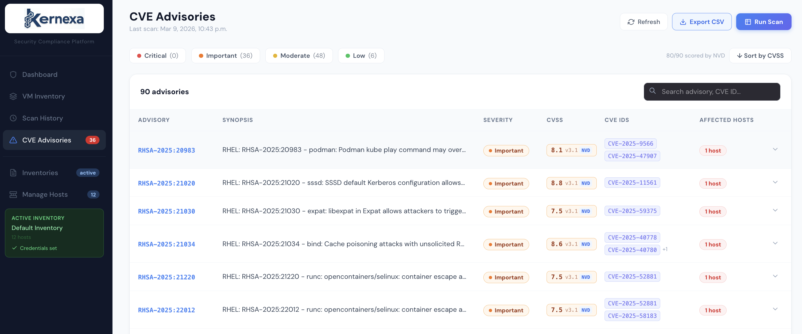

<div align="center">


**Security Patch Compliance Platform for Linux & Windows Infrastructure**

Kermonix scans remote hosts for pending security patches, outdated kernels, open ports, and CVE advisories using Ansible — surfacing everything in a real-time web dashboard backed by FastAPI and PostgreSQL.

[](https://github.com/JalenMak6/Kermonix/actions/workflows/ci.yml)
[](https://hub.docker.com/r/jalenmakdocker/kermonix)
[](LICENSE)

</div>

---



<details>
<summary>More screenshots</summary>





</details>

---

## Overview

Kermonix gives infrastructure and security teams a single pane of glass for patch compliance across heterogeneous environments. Upload an Ansible inventory, configure credentials once, and let Kermonix do the rest — scheduled scans, CVE enrichment from upstream advisory APIs, CVSS scoring, and formatted Excel reports delivered to your inbox after every run.

Key design decisions:
- **Agentless** — raw SSH scanning via `/bin/sh`; no Python or agent required on remote hosts
- **CVE-enriched** — advisory data fetched directly from RHSA, RLSA, ALSA, Ubuntu CVE Tracker, and NVD
- **Encrypted at rest** — SSH credentials AES-256 encrypted before DB write; decrypted in memory only at scan time
- **Self-hostable** — single `docker compose up -d`; no external services required beyond SMTP (optional)

---

## Supported Platforms

| Distribution | Versions | CVE Source |
|---|---|---|
| RHEL | 7, 8, 9, 10 | Red Hat Security API (RHSA) |
| Rocky Linux | 8, 9, 10 | Rocky Errata API (RLSA) |
| AlmaLinux | 8, 9, 10 | AlmaLinux Errata API (ALSA) |
| Ubuntu | 20.04, 22.04, 24.04 | Ubuntu CVE Tracker |
| Debian | 10, 11, 12 | Debian Security Tracker |
| Windows Server | 2012, 2016, 2019, 2022 | Microsoft WSUS / Windows Update (KB-based) |
| Windows | 10, 11 | Microsoft WSUS / Windows Update (KB-based) |

> Other distributions are scanned for kernel/package status but CVE enrichment is not available.  
> Windows hosts report pending KBs with MSRC severity ratings (Critical / Important / Moderate / Low) rather than CVE advisory IDs.

---

## Features

<details open>
<summary><strong>Scanning & Compliance</strong></summary>

- Kernel compliance — running kernel vs. latest available security kernel per host, sourced from upstream errata (not all available repo kernels)
- Pending security packages per host with per-package CVE linkage
- Raw SSH scanning via `/bin/sh` — compatible with Python 2.6, 3.x, or no Python at all
- Windows scanning over WinRM (NTLM) — pending KBs with MSRC severity ratings
- Open port detection per host
- Per-host Ansible failure capture — unreachable hosts surfaced with full Ansible log viewer
- Manual scan trigger or auto-scheduler (configurable interval — minutes/hours/days, persists across restarts)

</details>

<details open>
<summary><strong>CVE Advisories</strong></summary>

- Enriched from RHSA, RLSA, ALSA, Ubuntu CVE Tracker, and Debian Security Tracker
- CVSS scores fetched automatically after every scan — Red Hat scores preferred, NVD as fallback
- Score badge shows source (`RH` or `NVD`) so you know whether the score reflects RHEL-specific context
- Sortable by CVSS score, filterable by severity (Critical / Important / Moderate / Low)
- Patch remediation — apply patches directly from the CVE tab with dry-run support

</details>

---

## Architecture

```
┌─────────────────────────────────────────────────────────────┐
│                        Browser                              │
│              React + Vite (served as static files)          │
└──────────────────────────┬──────────────────────────────────┘
                           │ HTTP / REST
┌──────────────────────────▼──────────────────────────────────┐
│                     FastAPI (main.py)                       │
│  ┌──────────┐  ┌─────────────┐  ┌────────────────────────┐  │
│  │ auth.py  │  │ scheduler.py│  │      enricher.py       │  │
│  │ JWT/LDAP │  │ APScheduler │  │ RHSA·RLSA·ALSA·Ubuntu  │  │
│  └──────────┘  └──────┬──────┘  └────────────────────────┘  │
│                       │                                     │
│              ┌────────▼────────┐                            │
│              │  scan_tasks.py  │                            │
│              │ run_and_save()  │                            │
│              └────────┬────────┘                            │
│                       │                                     │
│         ┌─────────────▼──────────────┐                      │
│         │        scanner.py           │                     │
│         │  ansible-runner wrappers    │                     │
│         └─────────────┬──────────────┘                      │
└───────────────────────┼─────────────────────────────────────┘
                        │ SSH / WinRM
         ┌──────────────▼──────────────┐
         │       Remote Hosts           │
         │  Linux (raw SSH / /bin/sh)   │
         │  Windows (WinRM / NTLM)      │
         └─────────────────────────────┘
```

<details open>
<summary><strong>Dashboard & Reporting</strong></summary>

- Compliance trend chart across recent scans with KPI strip (compliance %, host counts, delta vs previous scan)
- Kernel compliance donut chart and top pending packages bar chart
- CVE severity summary cards linking directly to the CVE detail tab
- Per-host drill-down modal with three tabs: Overview · CVE Advisories · Kernel History
- Kernel history timeline showing compliance status across past scans with change detection
- Post-scan Excel report (.xlsx) emailed automatically — one sheet per OS group plus an All Hosts summary

</details>

<details open>
<summary><strong>Host Management</strong></summary>

- Tag hosts with labels (`production`, `staging`, `dmz`, `web`, `db`, `infra`, or any custom tag)
- Filter dashboard and host inventory by OS, kernel status, patch status, and tag
- Tags persist across scans and are managed inline from the host table
- Windows inventory managed independently from Linux inventory

</details>

<details open>
<summary><strong>Access Control</strong></summary>

- Three-role hierarchy: `admin` → `operator` → `reader`
- JWT authentication (short-lived access token + long-lived refresh token; stored for revocation)
- Optional LDAP / Active Directory integration — group-to-role mapping configured from the UI
- All users and roles managed from the Users tab

</details>

<details open>
<summary><strong>AI Assistant</strong></summary>

- Optional AI chat widget for querying scan results in natural language
- Supports OpenAI API or Azure OpenAI — configured via environment variables

</details>

---

## Stack

| Layer | Technology |
|---|---|
| Backend | Python 3 · FastAPI · APScheduler |
| Scanner | Ansible · ansible-runner · pywinrm |
| Database | PostgreSQL 16 |
| Frontend | React 18 · Vite · Tailwind CSS |
| Deployment | Docker · Docker Compose |
| Security | AES-256 (Fernet) · JWT (HS256) · bcrypt |

---

## Quick Start

### Option 1 — Pre-built Image (Recommended)

The fastest path to a running instance. No build step required.

**1. Clone the repository:**
```bash
git clone https://github.com/JalenMak6/Kermonix.git
cd Kermonix
```

**2. Create your environment file:**
```bash
cp env-example .env
```

**3. Generate required secrets:**
```bash
# AES-256 credential encryption key (required)
python3 -c "from cryptography.fernet import Fernet; print(Fernet.generate_key().decode())"

# JWT signing key (required)
openssl rand -hex 32
```
Add the outputs to `.env` as `CREDENTIALS_KEY` and `JWT_SECRET`.

**4. Start the stack:**
```bash
docker compose -f docker-compose-stable.yml up -d
```

- App: [http://localhost:8000](http://localhost:8000)
- Adminer (DB UI): [http://localhost:8080](http://localhost:8080)

Default admin credentials: `admin` / `password` — **change these immediately** via the Users tab.

**Updating to the latest stable release:**
```bash
docker compose -f docker-compose-stable.yml pull app
docker compose -f docker-compose-stable.yml up -d --force-recreate app
```

---

### Option 2 — Build from Source

Use this for development or to run a modified version.

```bash
git clone https://github.com/JalenMak6/Kermonix.git
cd Kermonix
cp env-example .env   # fill in your values
docker compose up --build -d
```

---

## Configuration

### Environment Variables

Copy `env-example` to `.env`. This file is never committed to source control.

```env
# ── Database ──────────────────────────────────────────────────────────────────
POSTGRES_DB=kermonix
POSTGRES_USER=kermonix_user
POSTGRES_PASSWORD=change_me

# ── Ports ─────────────────────────────────────────────────────────────────────
APP_PORT=8000
DB_PORT=5432
ADMINER_PORT=8080

# ── Required secrets ──────────────────────────────────────────────────────────
CREDENTIALS_KEY=          # Fernet key — generate: python3 -c "from cryptography.fernet import Fernet; print(Fernet.generate_key().decode())"
JWT_SECRET=               # 32-byte hex — generate: openssl rand -hex 32

# ── Default admin account (seeded on first start) ─────────────────────────────
KERMONIX_ADMIN_USER=admin
KERMONIX_ADMIN_PASS=change_me

# ── Optional: NVD API (raises rate limits for CVE scoring) ───────────────────
NVD_API_KEY=

# ── Optional: AI assistant ────────────────────────────────────────────────────
OPENAI_API_KEY=
# — or Azure OpenAI —
AZURE_OPENAI_API_KEY=
AZURE_OPENAI_ENDPOINT=
AZURE_OPENAI_DEPLOYMENT=gpt-4o-mini
AZURE_OPENAI_API_VERSION=2024-12-01-preview

# ── Optional: LDAP / Active Directory ────────────────────────────────────────
# Set LDAP_HOST to enable LDAP authentication. Additional settings are
# configured from the UI (Settings → Active Directory / LDAP).
LDAP_HOST=

# ── Development only ──────────────────────────────────────────────────────────
ENABLE_DOCS=false         # Set true to expose /docs, /redoc, /openapi.json
```

#### Variable reference

| Variable | Required | Description |
|---|---|---|
| `CREDENTIALS_KEY` | **Yes** | Fernet AES-256 key used to encrypt SSH credentials at rest. Losing this key means stored credentials must be re-entered. |
| `JWT_SECRET` | **Yes** | HMAC-SHA256 signing key for access and refresh tokens. |
| `KERMONIX_ADMIN_USER` / `KERMONIX_ADMIN_PASS` | **Yes** | Seeded on first startup. Change immediately after first login. |
| `NVD_API_KEY` | No | Raises NVD API rate limits significantly. Get one free at [nvd.nist.gov](https://nvd.nist.gov/developers/request-an-api-key). |
| `OPENAI_API_KEY` | No | Enables the AI chat widget using OpenAI. |
| `AZURE_OPENAI_*` | No | Enables the AI chat widget using Azure OpenAI (takes precedence over `OPENAI_API_KEY`). |
| `LDAP_HOST` | No | Enables LDAP/AD authentication when set. Full config in the UI. |
| `ENABLE_DOCS` | No | Exposes `/docs`, `/redoc`, `/openapi.json`. **Never enable on public-facing instances.** |

### SSH Credentials

SSH credentials are entered through the UI per inventory. They are encrypted with AES-256 (Fernet) before being written to the database and decrypted in memory only at scan time. No plaintext credentials are written to disk or stored in the database.

### LDAP / Active Directory

LDAP integration is configured entirely from the UI (Settings → Active Directory / LDAP). When `LDAP_HOST` is set, users can authenticate with their AD credentials. Groups are mapped to Kermonix roles (`admin` / `operator` / `reader`) from the UI — no config file changes required.

### Email Notifications

Post-scan reports are emailed automatically after every scan completes. Configure SMTP in Settings → Email Notifications:

- Supports Gmail (App Password), Office 365, and any STARTTLS or SMTP relay
- Recipients managed from the UI — no config file changes needed
- Report attached as a formatted **Excel workbook (.xlsx)** with one sheet per OS group plus an All Hosts summary

---

## Docker Hub

The Kermonix image is published at [hub.docker.com/r/jalenmakdocker/kermonix](https://hub.docker.com/r/jalenmakdocker/kermonix).

| Tag | Description |
|---|---|
| `stable` | Latest promoted production release |
| `latest` | Most recent dev build — updated on every push to `dev` |
| `v0.x.x` | Pinned release — never changes |

To pin to a specific version, set `IMAGE` in your `.env`:
```env
IMAGE=jalenmakdocker/kermonix:v0.0.1
```
---

The backend is split by responsibility:

| Module | Responsibility |
|---|---|
| `main.py` | Routes only — thin API layer |
| `scanner.py` | Ansible-runner wrappers; executes playbooks in `project/` |
| `scan_tasks.py` | Orchestrates scan → DB save → CVE enrichment → email |
| `enricher.py` | CVE enrichment from RHSA, RLSA, ALSA, Ubuntu CVE Tracker, NVD |
| `scheduler.py` | APScheduler background job on a configurable interval |
| `auth.py` | JWT creation/validation, bcrypt hashing, FastAPI dependency injection |
| `ldap_auth.py` | Optional LDAP/AD auth; enabled only when `LDAP_HOST` is set |
| `database/` | Subpackage; each file owns a logical domain (scans, hosts, inventories, users, settings) |
| `reports/linux.py` | Excel workbook builder + SMTP email for Linux scans |
| `reports/windows.py` | Windows equivalent |

---

## Development

**Backend (without Docker):**
```bash
pip install -r requirements.txt
cp env-example .env
ENABLE_DOCS=true uvicorn main:app --reload
```

**Frontend dev server:**
```bash
cd patch-scan-ui
npm install
npm run dev   # Vite on :5173 — proxies /api/* to :8000
```

---

## Testing

Tests are integration tests — they run against a live container, not mocks.

```bash
pip install -r requirements-test.txt

# Run the full suite
TEST_BASE_URL=http://localhost:8000 pytest tests/test_api.py --tb=short --verbose

# Run a specific class
pytest tests/test_api.py::TestScans --tb=short --verbose

# Run a single test
pytest tests/test_api.py::TestScheduler::test_get_interval --tb=short --verbose
```

See [tests/readme.md](tests/readme.md) for full setup, coverage map, and CI integration details.

---

## CI/CD

Kermonix uses GitHub Actions with a self-hosted runner for the full pipeline.

| Trigger | Pipeline |
|---|---|
| Push to `dev` | Build → Trivy scan → pytest → push `:latest` |
| PR to `main` | Build → Trivy scan (merge gate) |
| Merge to `main` | Build → Trivy scan → push `:stable` |
| `git tag v*.*.*` | Build → Trivy scan → push `:vX.X.X` + `:stable` |

Trivy blocks on CRITICAL CVEs. The image is not pushed if any test fails.

---

## API Reference

Interactive API docs (Swagger UI) are available at [http://localhost:8000/docs](http://localhost:8000/docs) when `ENABLE_DOCS=true` is set in `.env`.

> **Never enable `ENABLE_DOCS` on a public-facing instance** — it exposes your full API surface with no additional auth barrier.

---

## Security

- SSH credentials encrypted at rest with AES-256 (Fernet); encryption key stored in `.env`, never in the database
- Credentials decrypted in memory only at scan time — never written to disk
- JWT access tokens (15 min) + refresh tokens (7 days) stored for server-side revocation
- Three-role RBAC (`admin` / `operator` / `reader`) enforced at the API layer
- `/docs`, `/redoc`, and `/openapi.json` disabled by default

---

## Contributing

Pull requests are welcome. For larger changes, open an issue first to discuss the approach.

1. Fork the repository
2. Create a feature branch: `git checkout -b feature/my-feature`
3. Commit your changes with a clear message
4. Push to your fork and open a pull request against `dev`

Please ensure tests pass (`pytest tests/test_api.py`) before submitting.

---

## License

[MIT](LICENSE) © Kermonix Contributors
