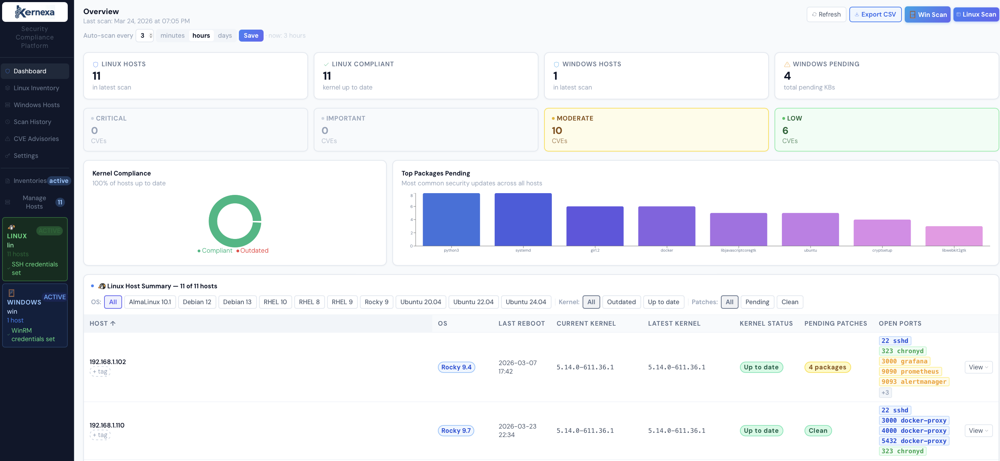

# Kernexa

An Security Patch Compliance Platform for Linux infrastructure. Kernexa uses Ansible to scan remote hosts for pending security patches, outdated kernels, opening ports and CVE advisories — all surfaced in a clean web dashboard.



## Stack

| Layer | Technology |
|-------|-----------|
| Backend | Python 3 / FastAPI |
| Scanner | Ansible + ansible-runner |
| Database | PostgreSQL 16 |
| Frontend | React + Vite |
| Deployment | Docker Compose |


## Supported OS and CVE Advisories

| Distribution | Versions | CVE Source |
| --- | --- | --- |
| RHEL | 7, 8, 9, 10 | Red Hat Security API (RHSA) |
| Rocky Linux | 8, 9, 10 | Rocky Errata API (RLSA) |
| AlmaLinux | 8, 9, 10 | AlmaLinux Errata API (ALSA) |
| Ubuntu | 20.04, 22.04, 24.04 | Ubuntu CVE Tracker |
| Debian | 10, 11, 12 | Debian Security Tracker |
| Windows Server | 2012, 2016, 2019, 2022 | Microsoft WSUS / Windows Update (KB-based) |
| Windows | 10, 11 | Microsoft WSUS / Windows Update (KB-based) |

> Other distributions are scanned for kernel/package status but CVE enrichment will not be available.
> Windows hosts report pending KBs with MSRC severity ratings (Critical / Important / Moderate / Low) rather than CVE advisory IDs.

---

## Deployment

There are two ways to run Kernexa — using the pre-built image from Docker Hub (recommended) or building from source.

### Option 1 — Pre-built Image (Recommended)

The easiest way to get started. No build step required — pulls the latest stable image directly from Docker Hub.

**1. Clone the repo to get the compose file and env template:**
``` bash
git clone https://github.com/JalenMak6/Kernexa.git
cd Kernexa
```

**2. Set up your environment:**
```bash
cp env.example .env
vi .env   # fill in your values
```

**3. Generate a credentials encryption key:**
```bash
python3 -c "from cryptography.fernet import Fernet; print(Fernet.generate_key().decode())"
```
Add the output to your `.env` as `CREDENTIALS_KEY`.

**4. Deploy using the stable compose file:**
```bash
docker compose -f docker-compose-stable.yml up -d
```

Open [http://localhost:8000](http://localhost:8000) — Adminer at [http://localhost:8080](http://localhost:8080).

**To update to the latest stable release:**
```bash
docker compose -f docker-compose-stable.yml pull app
docker compose -f docker-compose-stable.yml up -d --force-recreate app
```

---

### Option 2 — Build from Source

Use this if you want to run a modified version or contribute to development.

**1. Clone and configure:**
```bash
git clone https://github.com/JalenMak6/Kernexa.git
cd kernexa
cp env-example .env        # edit with your preferred credentials
```

**2. Generate a credentials encryption key:**
```bash
python3 -c "from cryptography.fernet import Fernet; print(Fernet.generate_key().decode())"
```
Add the output to your `.env` as `CREDENTIALS_KEY`.

**3. Build and start:**
```bash
docker compose up --build -d
```

Open [http://localhost:8000](http://localhost:8000) — Adminer at [http://localhost:8080](http://localhost:8080).

---

## Docker Hub

The Kernexa image is published at [hub.docker.com/r/jalenmakdocker/kernexa](https://hub.docker.com/r/jalenmakdocker/kernexa).

| Tag | Description |
|---|---|
| `latest` | Newest dev build — updated on every push to dev |
| `stable` | Last promoted production release |
| `v0.0.1` | Pinned release — never changes |

To pin to a specific version, update `IMAGE` in your `.env`:
```env
IMAGE=jalenmakdocker/kernexa:v0.0.1
```

---

## Configuration

### .env

Copy `env-example` to `.env` and set your own values. This file is never committed.

```env
POSTGRES_DB=kernexa
POSTGRES_USER=kernexa_user
POSTGRES_PASSWORD=supersecret
POSTGRES_PORT=5432
NVD_API_KEY=5fcxxxxxx
CREDENTIALS_KEY=cmuxxxxxxx
OPENAI_API_KEY=sk-proj-xxxxxxx
AZURE_OPENAI_API_KEY=Cxxxxxxxxxxx
AZURE_OPENAI_ENDPOINT=https://xxxx.cognitiveservices.azure.com/
AZURE_OPENAI_DEPLOYMENT=gpt-4o-mini
AZURE_OPENAI_API_VERSION=2024-12-01-preview
```

**NVD_API_KEY** is optional but recommended — it raises the NVD rate limit significantly when scoring CVEs. Get one free at [nvd.nist.gov/developers/request-an-api-key](https://nvd.nist.gov/developers/request-an-api-key).

**CREDENTIALS_KEY** is required. Generate a valid Fernet key with:
```bash
python3 -c "from cryptography.fernet import Fernet; print(Fernet.generate_key().decode())"
```
Keep this key safe — losing it means existing encrypted credentials in the DB can no longer be decrypted and will need to be re-entered in the UI.

**OPENAI_API_KEY** is optional
**AZURE_OPENAI_API_KEY** is optional
**AZURE_OPENAI_ENDPOINT** is optional
**AZURE_OPENAI_DEPLOYMENT** is optional
**AZURE_OPENAI_API_VERSION** is optional

**ENABLE_DOCS** controls whether the `/docs`, `/redoc`, and `/openapi.json` endpoints are exposed. Defaults to `false`. Set to `true` only in local development — never expose these on a public-facing instance as they allow anyone to browse and call your API directly.

### SSH Credentials

SSH credentials are entered through the UI per inventory. They are encrypted with AES-256 (Fernet) before being written to the database, and decrypted at scan time before being passed to ansible-runner. No plaintext credentials are ever written to disk or stored in the database.

### Email Notifications

Scan reports can be emailed automatically after every scan completes. Configure SMTP settings in the **Settings** tab of the UI.

- Supports Gmail (App Password), Office 365, or any STARTTLS/SMTP relay
- Recipients are managed from the UI — no config file changes needed
- The report is attached as a formatted **Excel workbook (.xlsx)**

#### Report Format

The workbook contains one sheet per OS group (e.g. `RHEL 7`, `RHEL 8`, `Ubuntu 22.04`, `Rocky 9`) plus an **All Hosts** summary sheet. Each pending security package is expanded to its own row for easy filtering and sorting in Excel.

| Column | Description |
|--------|-------------|
| Host | Hostname |
| OS | Full OS version string |
| Kernel Status | `Up to date` or `Outdated` |
| Current Kernel | Running kernel version |
| Latest Kernel | Latest available security kernel |
| Pending Pkg Count | Total number of pending security packages |
| Pending Security Package | One package per row |
| Last Reboot | Last system reboot time |
| Advisory Count | Number of security advisories |

---

## How It Works

1. Upload an Ansible inventory and set SSH credentials in the UI
2. Trigger a scan manually or let the auto-scheduler run (configurable interval from the dashboard)
3. Ansible collects kernel versions and pending security packages from each host using raw SSH — no Python version requirement on remote hosts
4. Results are saved to PostgreSQL and CVE data is enriched from upstream security APIs
5. CVSS scores are fetched automatically — Red Hat Security Data API as primary source, NVD as fallback
6. The dashboard shows compliance status, outdated kernels, CVE advisories, and CVSS scores per host
7. A formatted Excel report is emailed to configured recipients after every scan

---

## Features

**Scanning**
- Kernel compliance — current vs latest available security kernel per host, based on security advisories (RHSA/RLSA) rather than all available repo kernels
- Pending security packages per host
- Raw SSH scanning — works on any Python version including Python 2.6, 3.6, or no Python at all; uses `/bin/sh` to skip `.bashrc` and avoid shell noise from tools like conda
- Configurable auto-scan interval from the dashboard (minutes / hours / days) — persists across restarts
- Manual scan trigger available from the UI
- Scan failure capture — per-host Ansible errors and unreachable hosts surfaced in the UI with full Ansible log viewer

**CVE Advisories**
- Enriched from Red Hat (RHSA), Rocky Linux (RLSA), and Ubuntu CVE Tracker
- CVSS scores fetched automatically after every scan — Red Hat scores preferred, NVD fallback for unscored CVEs
- Score badge shows source (`RH` or `NVD`) so you know whether the score reflects RHEL-specific context
- Sortable by CVSS score; filterable by severity

**Dashboard**
- Compliance trend chart across recent scans with KPI strip (current %, compliant count, outdated count, delta vs previous scan)
- Kernel compliance donut chart and top pending packages bar chart
- CVE severity summary cards (Critical / Important / Moderate / Low) linking directly to the CVE tab
- Host table with OS, kernel status, pending patches, and per-host drill-down modal

**Host Drill-Down**
- Per-host modal with three tabs: Overview, CVE Advisories, Kernel History
- Kernel history timeline showing compliance status across past scans with change detection

**Host Management**
- Tag hosts with labels like `production`, `staging`, `dmz`, `web`, `db`, `infra` or any custom tag
- Filter the dashboard and VM Inventory by OS, kernel status, patch status, and tag
- Tags persist across scans and are managed inline from the host table

**Email Reports**
- Formatted Excel workbook (.xlsx) attached to post-scan email
- One sheet per OS group — RHEL 7/8/9/10, Rocky 8/9, Ubuntu 20.04/22.04/24.04, etc.
- All Hosts summary sheet included
- Each pending package on its own row for easy filtering in Excel
- SMTP configured entirely from the UI — no config file changes needed

**Security**
- SSH credentials encrypted at rest using AES-256 (Fernet symmetric encryption)
- Encryption key stored separately in `.env`, never in the database
- Credentials decrypted in memory only at scan time — never written to disk
- `/docs`, `/redoc`, and `/openapi.json` endpoints disabled by default — enable only for local development via `ENABLE_DOCS=true` in `.env`

---

## CI/CD

Kernexa uses GitHub Actions with a self-hosted runner for the full CI/CD pipeline.

| Trigger | Pipeline |
|---|---|
| Push to `dev` | Build → Trivy scan → pytest → push `:latest` |
| PR to `main` | Build → Trivy scan (merge gate) |
| Merge to `main` | Build → Trivy scan → push `:stable` |
| `git tag v*.*.*` | Build → Trivy scan → push `:vX.X.X` + `:stable` |

Trivy blocks on CRITICAL CVEs only. HIGH CVEs are reported in the scan email but do not block the pipeline.

---

## Testing

See [tests/README.md](tests/README.md) for full setup and usage.

```bash
pip install -r requirements-test.txt
TEST_BASE_URL=http://localhost:8000 pytest tests/test_api.py --tb=short --verbose
```

---

## API Docs

Interactive API docs are available at [http://localhost:8000/docs](http://localhost:8000/docs) when `ENABLE_DOCS=true` is set in `.env`. Never enable this on a public-facing instance.

---

## Development

**Backend without Docker:**
```bash
pip install -r requirements.txt
cp .env.example .env
ENABLE_DOCS=true uvicorn main:app --reload
```

**Frontend dev server:**
```bash
cd patch-scan-ui
npm install
npm run dev    # Vite on :5173 — proxies API calls to :8000
```
